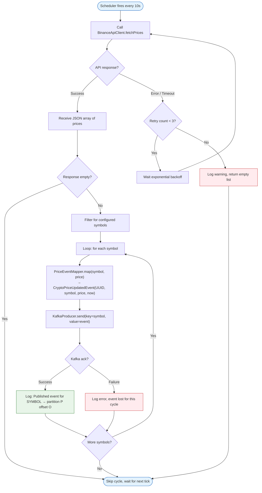
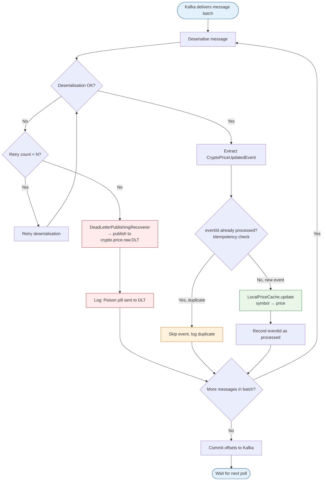
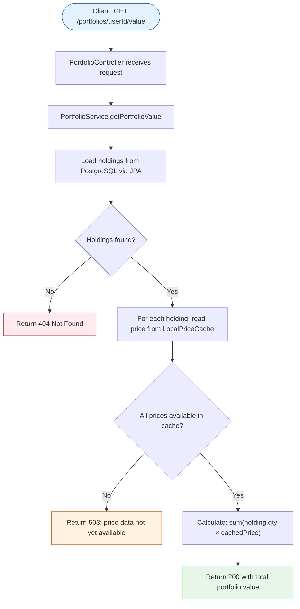

# Activity Diagrams

## 1. Price Polling & Publishing Workflow (market-data-service)

## 2. Event Consumption & Error Handling Workflow (portfolio-service)

## 3. Portfolio Valuation Query Workflow (portfolio-service REST)

