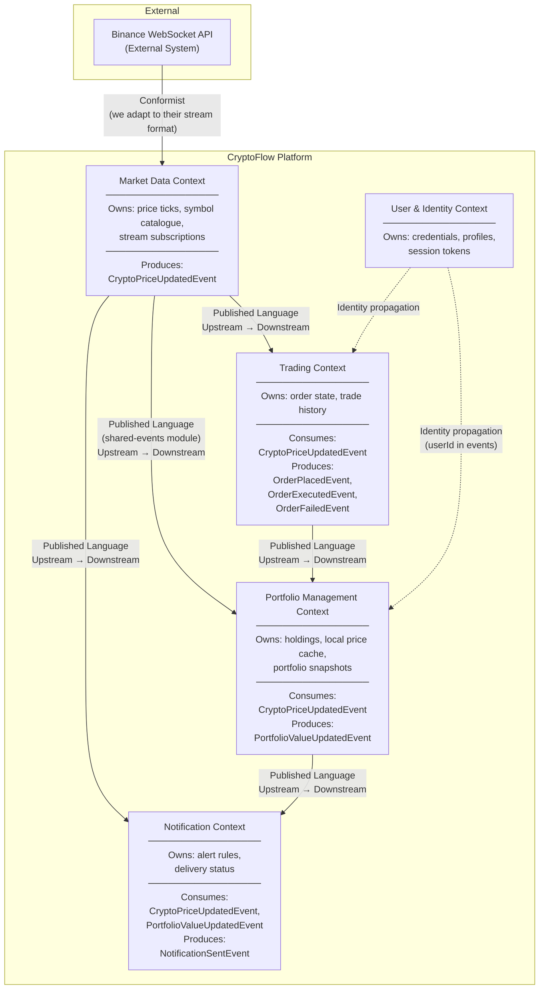

# Context Map – Bounded Contexts

## Overview

## Upstream / Downstream Summary

| Upstream | Downstream | Integration Pattern |
|----------|------------|---------------------|
| Binance WebSocket API | Market Data Context | WebSocket stream subscription, we adapt to their message format |
| Market Data Context | Portfolio Management Context | `shared-events` module, Kafka topic `crypto.price.raw` |
| Market Data Context | Trading Context | Kafka topic `crypto.price.raw` |
| Market Data Context | Notification Context | Kafka topic `crypto.price.raw` |
| Portfolio Management Context | Notification Context | Kafka topic (portfolio value events) |
| Trading Context | Portfolio Management Context | Kafka topic `portfolio.transactions` |
| User & Identity Context | Portfolio / Trading | `userId` propagated in event payloads |
