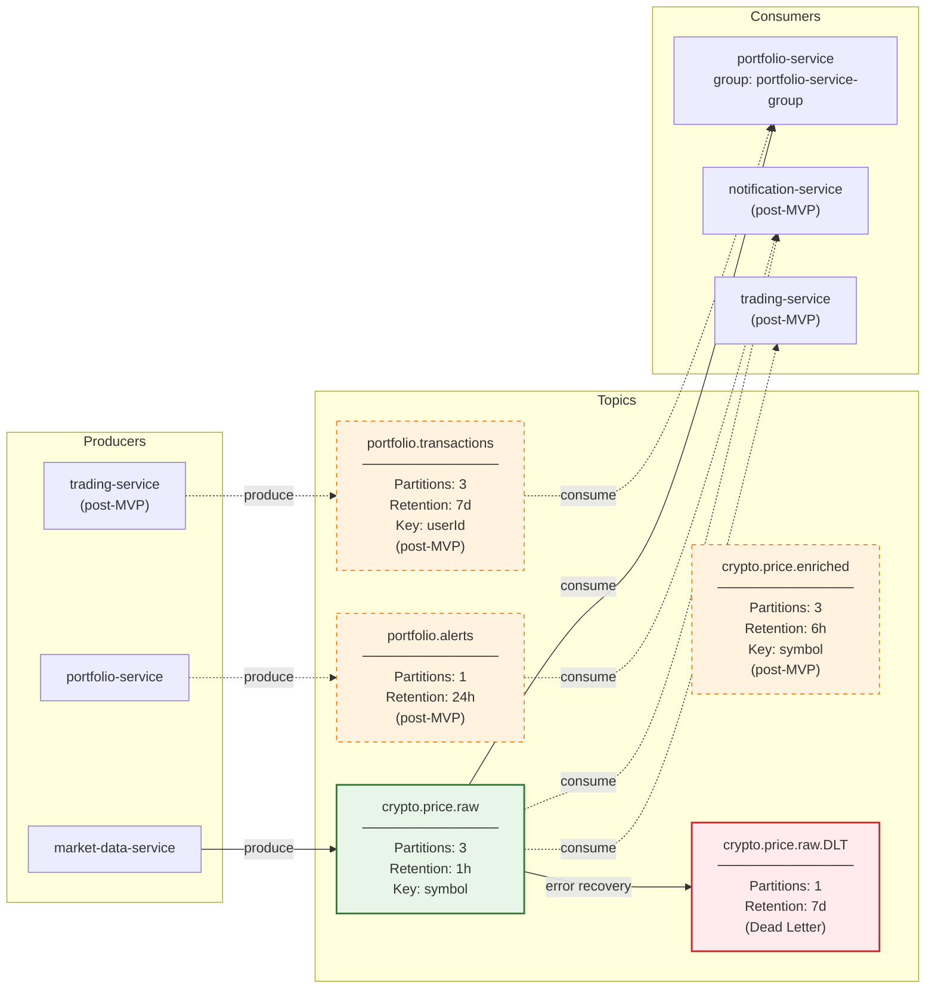
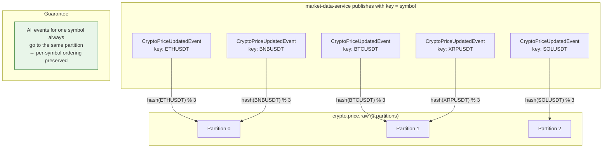

# Kafka Topic Topology

## Topic Overview

## Partition Key Strategy

> **Note:** The actual partition assignment depends on the Murmur2 hash of the key. The partition numbers above are illustrative.

## Topic Configuration Summary

| Topic | Partitions | Retention | Key | Producers | Consumers | Status |
|-------|-----------|-----------|-----|-----------|-----------|--------|
| `crypto.price.raw` | 3 | 1 h | symbol | market-data-service | portfolio-service | **MVP** |
| `crypto.price.raw.DLT` | 1 | 7 d | (original key) | DefaultErrorHandler | Ops (manual) | **MVP** |
| `crypto.price.enriched` | 3 | 6 h | symbol | — | — | Post-MVP |
| `portfolio.transactions` | 3 | 7 d | userId | trading-service | portfolio-service | Post-MVP |
| `portfolio.alerts` | 1 | 24 h | — | portfolio-service | notification-service | Post-MVP |
