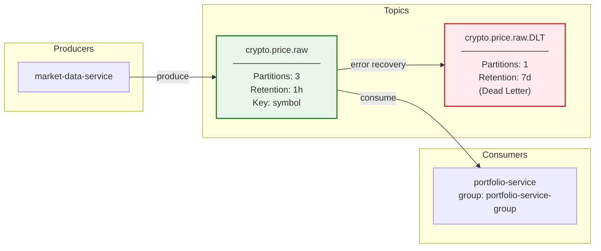
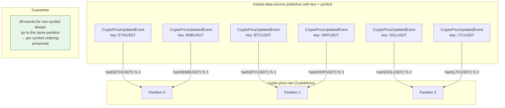

# Kafka Topic Topology

## Topic Overview

## Partition Key Strategy

## Topic Configuration Summary

| Topic | Partitions | Retention | Key | Producers | Consumers |
|-------|-----------|-----------|-----|-----------|-----------|
| `crypto.price.raw` | 3 | 1 h | symbol | market-data-service | portfolio-service |
| `crypto.price.raw.DLT` | 1 | 7 d | (original key) | DefaultErrorHandler | Ops (manual) |
