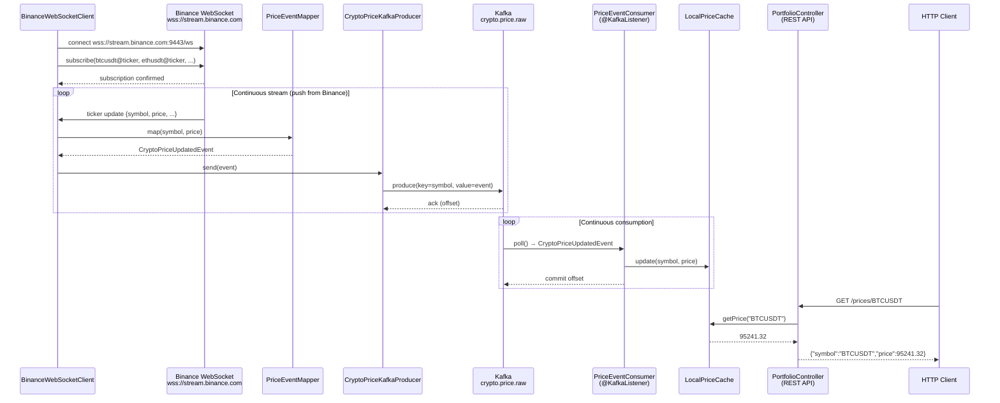
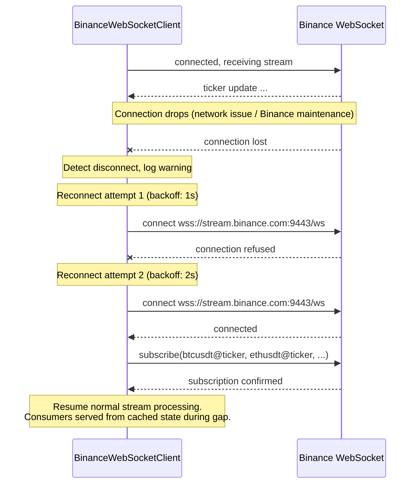
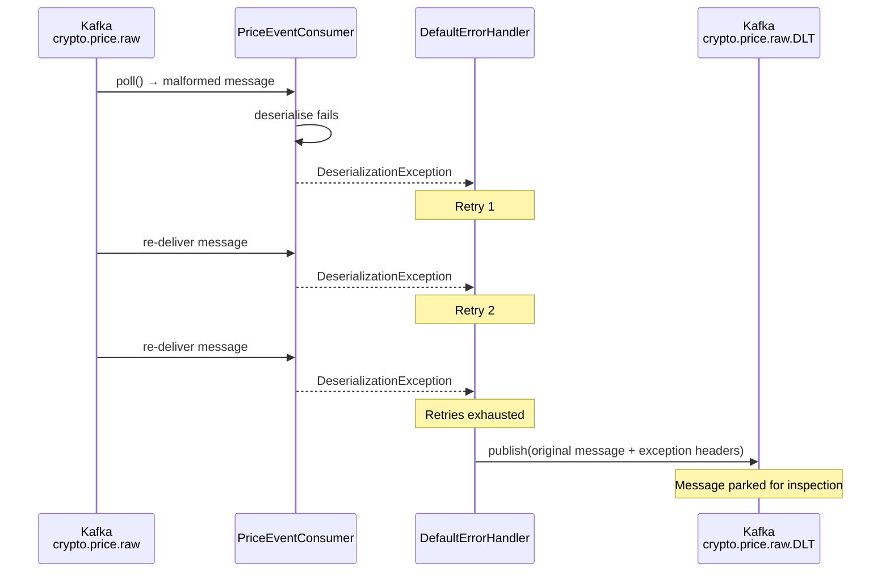

# Sequence Diagram – Event Flow

## Happy Path: WebSocket Stream → Portfolio Update

```mermaid
sequenceDiagram
    participant WSClient as BinanceWebSocketClient
    participant Binance as Binance WebSocket<br/>wss://stream.binance.com
    participant Mapper as PriceEventMapper
    participant Producer as CryptoPriceKafkaProducer
    participant Kafka as Kafka<br/>crypto.price.raw
    participant Consumer as PriceEventConsumer<br/>(@KafkaListener)
    participant Cache as LocalPriceCache
    participant REST as PortfolioController<br/>(REST API)
    participant Client as HTTP Client

    WSClient->>Binance: connect wss://stream.binance.com:9443/ws
    WSClient->>Binance: subscribe(btcusdt@ticker, ethusdt@ticker, ...)
    Binance-->>WSClient: subscription confirmed

    loop Continuous stream (push from Binance)
        Binance->>WSClient: ticker update {symbol, price, ...}
        WSClient->>Mapper: map(symbol, price)
        Mapper-->>WSClient: CryptoPriceUpdatedEvent
        WSClient->>Producer: send(event)
        Producer->>Kafka: produce(key=symbol, value=event)
        Kafka-->>Producer: ack (offset)
    end

    loop Continuous consumption
        Kafka->>Consumer: poll() → CryptoPriceUpdatedEvent
        Consumer->>Cache: update(symbol, price)
        Consumer-->>Kafka: commit offset
    end

    Client->>REST: GET /prices/BTCUSDT
    REST->>Cache: getPrice("BTCUSDT")
    Cache-->>REST: 95241.32
    REST-->>Client: {"symbol":"BTCUSDT","price":95241.32}
```

## Error Path: WebSocket Disconnection & Reconnect

```mermaid
sequenceDiagram
    participant WSClient as BinanceWebSocketClient
    participant Binance as Binance WebSocket

    WSClient->>Binance: connected, receiving stream
    Binance-->>WSClient: ticker update ...

    Note over Binance,WSClient: Connection drops (network issue / Binance maintenance)
    Binance--xWSClient: connection lost

    Note over WSClient: Detect disconnect, log warning
    Note over WSClient: Reconnect attempt 1 (backoff: 1s)
    WSClient->>Binance: connect wss://stream.binance.com:9443/ws
    Binance--xWSClient: connection refused

    Note over WSClient: Reconnect attempt 2 (backoff: 2s)
    WSClient->>Binance: connect wss://stream.binance.com:9443/ws
    Binance-->>WSClient: connected

    WSClient->>Binance: subscribe(btcusdt@ticker, ethusdt@ticker, ...)
    Binance-->>WSClient: subscription confirmed
    Note over WSClient: Resume normal stream processing.<br/>Consumers served from cached state during gap.
```

## Error Path: Poison Pill → Dead Letter Topic

```mermaid
sequenceDiagram
    participant Kafka as Kafka<br/>crypto.price.raw
    participant Consumer as PriceEventConsumer
    participant ErrHandler as DefaultErrorHandler
    participant DLT as Kafka<br/>crypto.price.raw.DLT

    Kafka->>Consumer: poll() → malformed message
    Consumer->>Consumer: deserialise fails
    Consumer-->>ErrHandler: DeserializationException

    Note over ErrHandler: Retry 1
    Kafka->>Consumer: re-deliver message
    Consumer-->>ErrHandler: DeserializationException

    Note over ErrHandler: Retry 2
    Kafka->>Consumer: re-deliver message
    Consumer-->>ErrHandler: DeserializationException

    Note over ErrHandler: Retries exhausted
    ErrHandler->>DLT: publish(original message + exception headers)
    Note over DLT: Message parked for inspection
```
